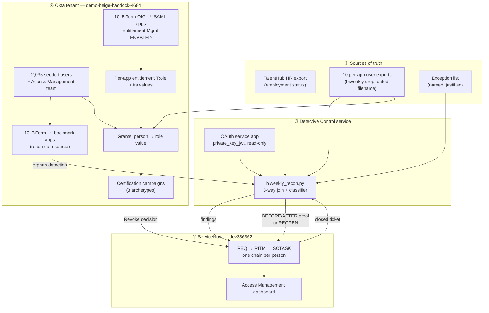
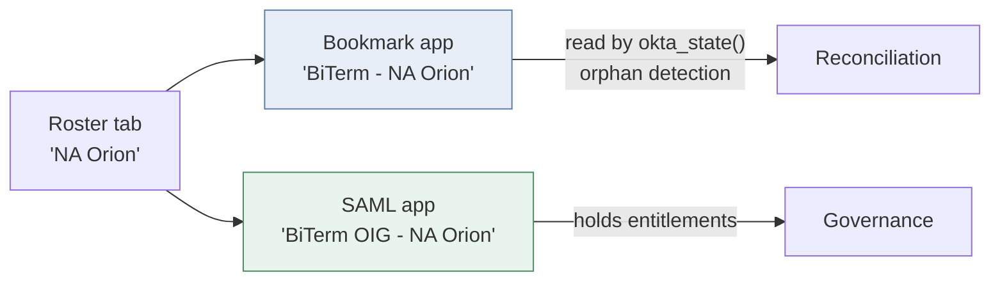
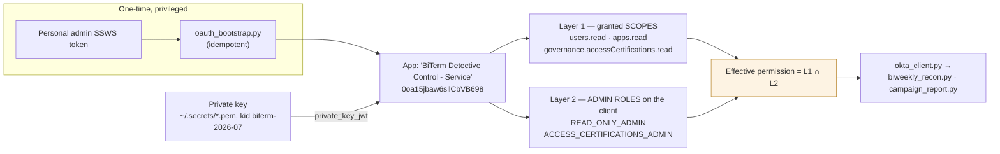
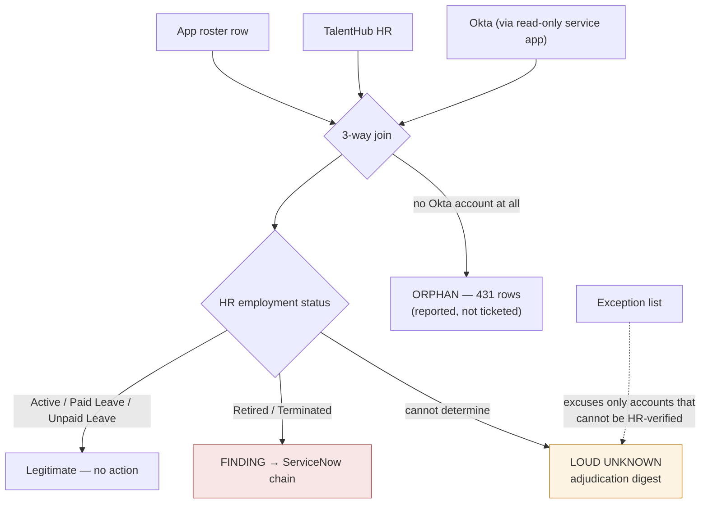
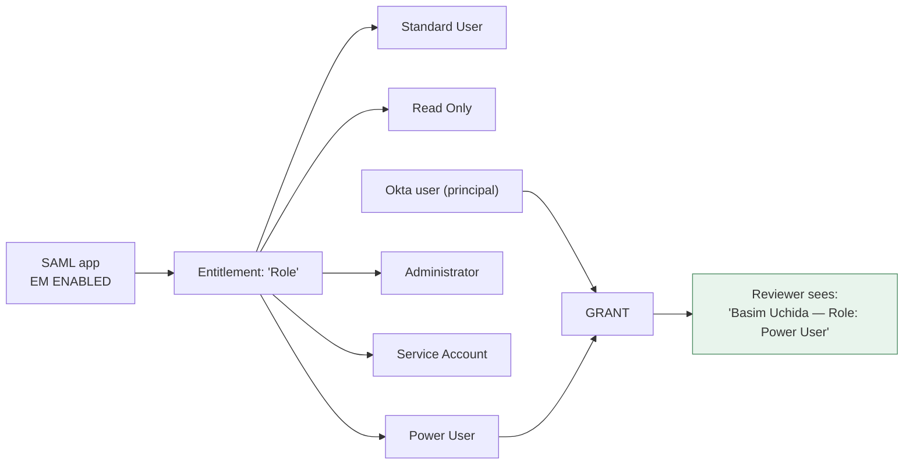
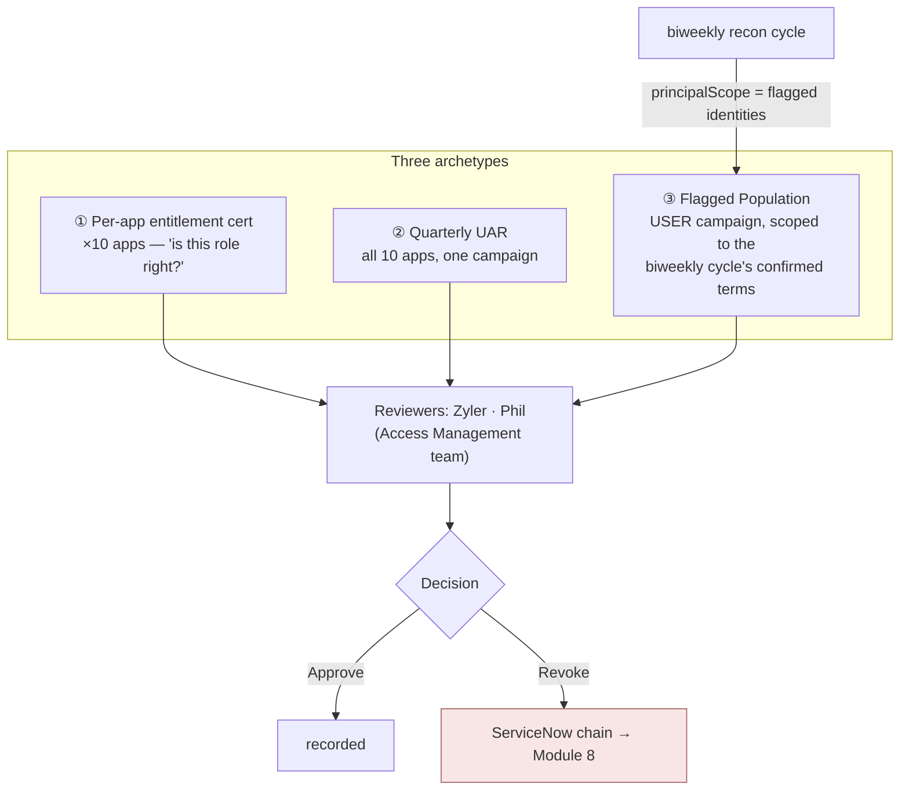
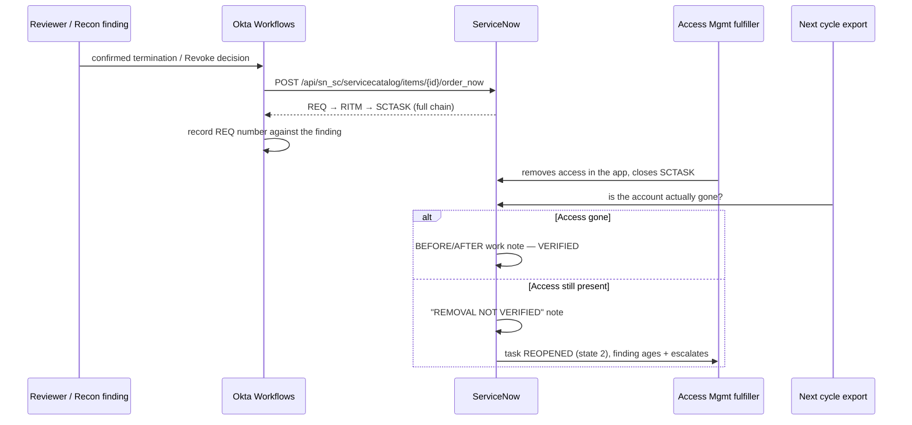

# BiTerm — End-to-End Build Lab

**What this document is:** a visual, module-by-module record of *everything that was built* to take
the biweekly termination review from a spreadsheet process to a governed, evidenced,
ticket-closed-loop control on Okta Identity Governance + ServiceNow.

**How it differs from the other docs in this folder:**

| Doc | Answers |
|---|---|
| [`TERM_FLOW_EXPLAINER.md`](./TERM_FLOW_EXPLAINER.md) | *Why* the biweekly review exists at all |
| [`OIG_TERMINATION_LAB.md`](./OIG_TERMINATION_LAB.md) | *How you do it by hand*, one click at a time, for one app |
| **this doc** | *What was actually built, in what order, why each piece was chosen, and why each piece is safe to run at an enterprise* |
| [`OIG_WORKFLOWS_BUILD_GUIDE.md`](./OIG_WORKFLOWS_BUILD_GUIDE.md) | The Console-only Workflows build (no API can create a flow) |
| [`OIG_FEASIBILITY_BRIEF.md`](./OIG_FEASIBILITY_BRIEF.md) | "Is this real?" briefing for people who weren't in the room |

**Reading key** — every module below uses the same four blocks:

> 🧱 **BUILT** — what exists · 🎯 **WHY THIS WAY** — the decision and its alternative ·
> ✅ **BENEFIT** — what it buys the program · 🔒 **ENTERPRISE-SAFE BECAUSE** — the security argument

**Honesty marker** — every module is tagged with its real state:
`✅ PROVEN` (verified by an independent gate) · `⚠️ IN FLIGHT` (deliberately halted, reason stated) ·
`📐 DESIGNED` (built as a tested reference, not executed in the tenant).

---

## Module 0 — The whole system on one page

**The single most important line on that diagram is the one going *back* from ServiceNow into the
pipeline.** Everything else is detection. That arrow is what makes the control trustworthy: a
closed ticket is treated as a *claim*, and the next cycle's export is what settles it.

### Two facts that shaped every design decision below

> **Fact 1 — the app *type* decides whether it can be governed at all.**
> Entitlement Management cannot be switched on for Bookmark apps — the option does not exist for
> that type, and `PUT /api/v1/apps/{id}` accepts the field, returns **200, and silently ignores
> it**. Governing an app is a *rebuild* as SAML, not a toggle. (Confirmed in the Console and by API.)

> **Fact 2 — a Revoke decision and a closed ticket are both claims, not removals.**
> Okta's campaign remediation is set to `NO_ACTION` on every outcome by design. Nothing in this
> system removes access. The control detects, evidences, tickets, and then *verifies against the
> next export* — and reopens the ticket if the access is still there.

---

## Module 1 — The data, and making it safe to use `✅ PROVEN`

> 🧱 **BUILT**
> - `xlsx_min.py` — a zip + sheet-XML reader (the environment has no `openpyxl`), correct on the
>   header-offset and cell-placement quirks of the real workbooks.
> - `reidentity.py` — full re-identification of every person in scope against a synthetic
>   international name pool: 5,157 anchors, per-cell mapping, deterministic seed. Off-scheme
>   stems (`jphilpott1`) keep their own shape; naming schemes, case, padding and even the source
>   data's *defects* are preserved, because the defects are what the pipeline has to survive.
> - `rename_tenant.py` — in-place rename of all 2,027 live users, preserving ids and assignments.
> - `verify_reidentity_tenant.py` — the gate: scans **every** live seeded user against the token
>   union of **all** source files.

> 🎯 **WHY THIS WAY**
> The obvious cheap alternative — rotating the first-name column by 10 rows — was **rejected**: a
> permutation of real values is still real values. Surnames never move, login stems survive
> verbatim, and anyone with the original sheet can undo it. A synthetic pool with a preserved
> *shape* gives you realistic test data that is not anyone.

> ✅ **BENEFIT**
> The tenant can hold a full-scale, realistically messy population (duplicate seats, off-scheme
> admin accounts, malformed status cells, future-dated terminations) so the pipeline is tested
> against the real failure modes — with zero real identities present.

> 🔒 **ENTERPRISE-SAFE BECAUSE**
> The gate enforces the guarantee that actually matters: **zero original first+last *pairings***
> among seeded users (the pairing is the re-identifiable unit). Lone token coincidences over a
> 7,779-person source are reported as a note, not a failure — a gate that always fails is a
> liability nobody reads. Live result: **0 pairings → VERDICT: PASS.**
> A real incident is on record and drove this design: two family names from the *source* file were
> spotted live in Okta, deleted within minutes, and confirmed 404. The gate now scans against
> every source file's token union rather than the sheets in scope.

---

## Module 2 — Creating the apps `✅ PROVEN`

> 🧱 **BUILT**
> - `seed_tenant.py` — 11 **Bookmark** apps (`BiTerm - <tab>`), idempotent, 429-backoff, resumable,
>   writing `seed_manifest.json` (every id and every identity's fate).
> - `oig_saml_rollout.py --apply` — the 9 remaining apps re-created as **custom SAML**
>   (`BiTerm OIG - <tab>`); ComSat already existed as the pilot → **10 governable apps**, all
>   re-queried live as SAML + ACTIVE. Manifest: `oig_apps.json` (tab → app_id → roles → EM status).
> - The **user** then enabled Entitlement Management on all 10 in the Console — UI-only, no API
>   exists — and `em=ENABLED` was verified on all 10 directly rather than taken on trust.

> 🎯 **WHY THIS WAY — two prefixes, on purpose.**
> The bookmark apps were not deleted when the SAML ones arrived. The reconciliation's
> `okta_state()` reads apps by the `BiTerm - ` prefix; the governance tooling reads
> `BiTerm OIG - `. **The two populations are deliberately disjoint**, so bringing an app under
> governance cannot silently change what the detective control sees. Retiring the bookmarks is a
> separate, costed decision — not a free side effect.

> ✅ **BENEFIT**
> A disconnected app (no SCIM, no connector, just a CSV drop) becomes governable *today*, with the
> same entitlement model, campaigns, reviewers, decision history and evidence trail it will have
> after SCIM onboarding. SCIM later swaps the data source underneath — it does not remodel anything.

> 🔒 **ENTERPRISE-SAFE BECAUSE**
> `oig_saml_rollout.py` is idempotent (an existing label is reused, never duplicated) and does
> **not** enable Entitlement Management — that stays a deliberate human action in the Console, per
> app, with the manifest as the checklist. Automation creates the container; a person decides what
> comes under governance.
>
> **Known distinction worth stating plainly:** in the CSV-fed model, Okta's picture of who has what
> is an **assertion** (it cannot be wrong in a way Okta can detect). Under SCIM it becomes an
> **observation** (drift surfaces on its own). That is exactly why the external reconciliation in
> Module 5 is load-bearing today, and why it *shrinks* rather than disappears later.

---

## Module 3 — Creating the users `✅ PROVEN`

> 🧱 **BUILT**
> `seed_tenant.py` created **7,505 users** initially (later reduced to ~2,035 in BiTerm scope when
> the obsolete SFDC/DocuSign population was removed), login = UPN on the fake domain
> `bitermtest.com`, plus ~8,622 app assignments.
>
> The population is a **deliberate test surface**, deterministic on `sha256(login) % 10`:
>
> | Planted condition | Count / share | What it exercises |
> |---|---|---|
> | Roster rows with no UPN | 409 | App-side **orphans** (no Okta account to join to) |
> | Terminated/Retired, still ACTIVE in Okta | ~40% of terms | The un-deprovisioned failure mode the control exists to catch |
> | Terminated/Retired, SUSPENDED | ~30% | Unpaid-leave vs. terminated ambiguity |
> | Terminated/Retired, never created | ~30% | "No Okta account at all" branch |
> | Pre-existing demo-org users | exactly 18 | Blast-radius check — must remain untouched |

> 🎯 **WHY THIS WAY**
> A clean population proves nothing. Requirement #2 of this control is to report accounts with
> *no related Okta account — enabled, disabled, or nonexistent*. All three branches had to exist
> in the data before the classifier could be trusted to distinguish them.

> ✅ **BENEFIT**
> Every branch of the classifier has a live example, so a regression in any one of them shows up
> as a changed count in the next verification run rather than as a silent miss in production.

> 🔒 **ENTERPRISE-SAFE BECAUSE**
> - Seeding is **idempotent and manifest-recorded** — every created id and every identity's fate is
>   written down, so the blast radius of any change is knowable.
> - `verify_seed.py` recomputes expected state **from the source files** and reconciles against a
>   live API pull, ending in one `VERDICT: PASS|FAIL` line. Live: **PASS on all 5 checks**
>   (7,505 users, 8 absent-as-designed, exact statuses, 0 name mismatches, all 11 apps' assignment
>   sets exact at 8,622, 18 pre-existing users untouched).
> - One account, `bchue@wm.com`, is a **permanent off-limits allowlist entry** in every script and
>   every gate. Named exclusions beat "be careful".

---

## Module 4 — The Detective Control service `✅ PROVEN`

This is the identity the control runs as. It is the module with the strongest security argument in
the whole build.

> 🧱 **BUILT**
> - OAuth service app **"BiTerm Detective Control - Service"** using **`private_key_jwt`** — no
>   client secret exists to leak.
> - `oauth_bootstrap.py` — the one-time privileged setup, idempotent, the *only* place the personal
>   admin token is used. This mirrors production, where tenant IAM runs setup once.
> - `okta_client.py` — token cached with a 5-minute refresh margin, same call signatures as the
>   seeder's client, so switching auth was a drop-in.
> - `verify_oauth.py` — the independent gate. **VERDICT: PASS**, including the *negative* cases:
>   a write `POST` returns **403**, and a token request for an ungranted scope is refused with
>   `consent_required`.

> 🎯 **WHY THIS WAY**
> The pipeline originally ran on an SSWS admin token. That was rejected on the user's own mandate:
> an SSWS token is **person-bound, unscoped, and dies with the person's account** — it cannot pass a
> SOX access review of the control itself. A service app with asymmetric-key auth and named scopes
> can.
>
> **The key discovery, and the thing to carry into any production access request:** granted scopes
> alone yield `E0000006`. On this org, **effective permission = granted scopes ∩ admin roles
> assigned to the client principal**. Both layers are load-bearing. A prod request that asks for
> only one of them will look approved and still fail.

> ✅ **BENEFIT**
> - The control's identity is auditable on its own terms: you can answer "what can this control
>   read?" without reference to any employee.
> - Staff turnover does not break the control, and revoking a person's admin rights does not
>   silently disable the biweekly run.
> - Verified two independent ways: an **equivalence proof** (a full tenant pull via both the SSWS
>   and the OAuth client, diffed — 7,523 users, 10 apps, **0 mismatches, VERDICT: PASS**) and a full
>   `campaign_report.py` run under OAuth.

> 🔒 **ENTERPRISE-SAFE BECAUSE**
> - **Read-only by construction.** The service principal cannot write. That is not a policy — it is
>   proven by a 403 in the gate. A detective control that cannot mutate the systems it inspects
>   cannot destroy the evidence it exists to produce.
> - **Two-layer least privilege**, both layers minimal and named.
> - **Privilege separation by design:** `seed_tenant.py` and campaign *management* deliberately stay
>   on the admin token, because they are privileged scaffolding — **not the control**. Campaign
>   creation needs `accessCertifications.MANAGE`, which the service app does not have, on purpose.
> - Key material lives in `~/.secrets/` (0600), never in a repo, never in a Workflows card.

---

## Module 5 — The detective control itself `✅ PROVEN`

`biweekly_recon.py` — the pipeline that replaced the manual VLOOKUP process.

> 🧱 **BUILT**
> Per cycle, under `cycles/cycle_<timestamp>/`: an evidence workbook (`report.xlsx`, findings
> sorted first), an immutable `state.json` including the **source rows** behind every finding, and
> three digests (admin / adjudication / ownership).
> `feed_ingest.py` adapts raw unjoined drops into the exact same shapes, so the front half can be
> replaced by a Workflows flow without touching the verified classifier.

> 🎯 **WHY THIS WAY — three design rules, each bought with a real defect**
>
> 1. **An exception never suppresses a positive termination hit.** A process simulation found
>    `avery.gonzalez` was *both* Terminated *and* exception-listed; with exception-matching running
>    first, a terminated privileged account was silently suppressed **every cycle**. The HR check
>    now runs on everyone; exceptions only excuse accounts that cannot be HR-verified.
> 2. **The unknown branch is loud.** The census is 30 clearly-terminated against **478 ambiguous**
>    rows — a 16:1 ratio. Adjudicating "can't tell" *is* the control's real cost. Defaulting
>    ambiguity to "fine" would have hidden the entire actual workload.
> 3. **A missing export is an error, never an empty app.** An empty app reads as "every account
>    vanished" and would hand closure verification a 100% false-closure rate.

> ✅ **BENEFIT**
> Beyond replacing steps 3–4 of the manual process: **coverage went from 12 of 19 apps to any app
> with an export**, the 3-way join added orphan detection that VLOOKUP never provided, and 478
> ambiguous rows that used to pass silently are now surfaced.
>
> Reconciled live run (feed mode, all 10 apps): 4,404 app rows + 2,035 HR rows → 3,996 joined /
> 201 no-HR-match / 207 unjoinable → **57 REQ/RITM/SCTASK chains created, 0 errors**, 454 unknowns,
> 431 orphans, independently re-queried out of ServiceNow (57/57 REQs and RITMs resolve live).

> 🔒 **ENTERPRISE-SAFE BECAUSE**
> - **The pipeline never removes access.** Remediation is manual in the real app; the control
>   detects, evidences, tracks, and confirms closure on the *next* cycle. The control documentation
>   is forbidden from claiming otherwise.
> - **Dry-run by default.** Ticket creation requires an explicit `--create-tickets`.
> - **Rehearsals cannot pollute the record.** A real defect was found and fixed here: a dry run
>   wrote `state.json` into the live lineage, so the next real cycle read it as a prior cycle of
>   record and aged every finding to "escalated". The baseline is now the most recent state with
>   `tickets_live` true — *a rehearsal is never a cycle of record*.
> - **Counting discipline.** The report once said "75 tickets" while ServiceNow held 57, because
>   flagged *rows* were counted under a *tickets* heading (one person's three seats = one finding =
>   one ticket). Rows, chains and people are now three separate, labelled numbers. In a SOX
>   artifact, an unexplained number is a finding.

---

## Module 6 — Entitlements and grants `✅ PROVEN (correctness stop raised and cleared)`

This is where "who has the app" becomes "**what can they do inside it**".

> 🧱 **BUILT**
> - `oig_pilot_load.py` + `verify_oig_pilot.py` — proven end-to-end on **NA Saturn ComSat**:
>   entitlement `Role` with 5 values mirroring the drop's `app_role`; coverage on the 32-row drop
>   reconciled exactly as **20 granted + 12 orphans = 32**. The gate returned **VERDICT: PASS on 14
>   checks** — and was **proven able to fail** (a role was flipped in the drop, the mismatch was
>   caught, the drop regenerated, PASS restored).
> - A per-app `Role` entitlement now exists on **all 10** apps, each with that app's own role list.
> - The working grant shape (`POST /governance/api/v1/grants`): `grantType:"CUSTOM"`,
>   `target{externalId:appId,type:APPLICATION}`,
>   `targetPrincipal{externalId:userId,type:OKTA_USER}`, `action:"ALLOW"`,
>   `entitlements:[{id, values:[{id}]}]`.

> 🎯 **WHY THIS WAY**
> Entitlements do **not** require SCIM — plain SAML apps hold real entitlements. That is the finding
> that makes governing 10 disconnected apps possible at all. The grant carries the **value**;
> writing app-user profile attributes is *not* the mechanism (those attributes come back null).

> 🚨 **THE CORRECTNESS STOP, AND HOW IT WAS CLEARED — the most important sequence in this document**
>
> **The defect.** The bulk loader was **killed mid-run on purpose**. The drops carry heavy duplicate
> emails (one person, several accounts in the same app — Stellar 539 duplicate rows, Orion 293), and
> **136 emails hold *conflicting* roles across their rows** — e.g. one identity that is both *Power
> User* and *Administrator* in NA Orion. The loader used a single-value entitlement with
> **first-row-wins**, so it could grant "Power User" and drop "Administrator" — **hiding an
> administrator behind a lower privilege, in the exact control whose purpose is to surface
> privilege.** Finishing the load would have produced a tenant that looked complete and certified
> wrongly.
>
> **What the constraint turned out to be** (probed live on one app before committing to ten):
>
> | Operation | Result |
> |---|---|
> | `PATCH` / `PUT` a grant's value | **400** — grants are immutable in place |
> | `DELETE /grants/{id}` | **400** — grants cannot be individually removed |
> | Flip an entitlement's `multiValue` false→true | **400** — cannot change in place |
> | `DELETE` the entitlement | 204, but grants do **not** cascade — they persist as *bare* grants |
> | `POST` a grant for an existing principal with a different value | **REPLACES the value** — the only lever that exists |
>
> **The decision — Option B+, highest privilege wins** (Administrator > Power User > Standard User >
> Read Only > Service Account). Chosen because the replace semantics make it a clean,
> deletion-free correction; `multiValue` cannot be flipped in place; and per-account detail already
> lives in the reconciliation under the two-control split. **Privilege can never be hidden behind a
> lower role.**
>
> **The clean reload.** `oig_load_all.py` reworked to aggregate every distinct role a person holds
> per app and grant the single highest, re-POSTing only when the current value ≠ the winner
> (idempotent). Applied run: **err=0, granted=1,069, corrected=37** conflicted principals whose
> first-row value was *not* the highest (Orion 22, Stellar 12, HQ 2, Central 1), unchanged=2,024,
> conflicted=136, orphans=431.
>
> **The verdict.** `oig_verify_all.py` reworked to check the highest-privilege contract *per
> principal*, with its coverage math fixed (it had conflated principal-count with row-count, which
> breaks on every app with duplicate rows) and un-deletable bare grants reported as WARN, not FAIL.
> **`--selftest` injects a bogus role and FAILS on all 10 — the checker is proven falsifiable —
> and the real run returns `VERDICT: PASS (10 apps, 0 failures)` with no bare-grant warnings.**

> ✅ **BENEFIT**
> Certification moves from a binary ("does this person still need this app?") to the question an
> auditor actually asks ("should this person still be an *Administrator* of this app?").

> 🔒 **ENTERPRISE-SAFE BECAUSE**
> - The verification gate has veto power over "done", and it used it. **Stopping a load because it
>   could mask privilege is the control working**, not the project slipping — and the fix was a
>   probed API contract plus a rework, not a retry.
> - **The privilege ceiling is a contract, not a hope:** every principal holds the highest role any
>   of their accounts carries, and the verifier asserts exactly that, per principal.
> - **The checker is proven falsifiable.** `--selftest` injects a bogus role and must fail; it fails
>   on all 10. A gate that has never been shown to fail is not evidence.
> - The loader refuses to run unless `emOptInStatus == ENABLED`, and re-POSTs only when the current
>   value is wrong — so a re-run is safe and near-silent.
> - The verifier is independent: it rebuilds expectations from the drop file and the live tenant
>   rather than trusting the loader's own logs.
> - **Known and disclosed:** grants cannot be deleted through the API at all, so a decommissioned
>   app's grants persist as bare grants. That is a documented platform limit, reported as WARN, not
>   something the tooling can silently clean up.

---

## Module 7 — Certification campaigns `✅ PROVEN — one LIVE, one deliberately dormant`

> 🧱 **BUILT**
> - **`oig_run_campaigns.py` (the current tool), run against the fully loaded tenant:**
>   - **LIVE — `BiTerm — Access Certification (LIVE): NA Saturn ComSat`** (`ici11c29d1yN6cZo9697`),
>     launched and **ACTIVE**: **20 review items = 20 grants, 0 of them lacking `entitlementValue`**
>     (roles under review: 14 Standard User, 4 Read Only, 1 Power User, 1 Administrator). The
>     landmine below was avoided, and that is verified by inspection rather than assumed.
>   - **DORMANT — `BiTerm — Access Certification (PREPARED): CloudForce HQ`**
>     (`ici11c297d4rUoS5P697`): created only, left `SCHEDULED` with a +365-day start, **never
>     launched** — the demonstration that preparing a campaign and starting one are separate acts.
>   - `oig_build_campaigns.py` (the three-archetype builder) still exists and is **still never run**.
> - **Earlier pilot proof:** campaign `ici119gnldxDWagCy697` ACTIVE with **20 items, each carrying
>   `entitlementValue{name, entitlement{name:"Role"}}`** — the reviewer certifies
>   *"Basim Uchida — Role: Standard User"*, not *"has the app"*.
> - **Proven live in the bookmark era**, on re-identified users: Targeted Resource (ComSat, 20 items
>   = exact assignment count), Quarterly UAR: Saturn Regional (392 = 129+133+130 — and it catches a
>   flagged Saturn West assignment inside a *routine* UAR), Flagged Population (27 items,
>   **27/27 cross-referenced back to recon findings**; the 4 identities with no Okta account were
>   correctly uncertifiable).
> - The all-apps builder **creates but never launches**: start date ~365 days out, campaigns land
>   `SCHEDULED`, and the script **reads each campaign back and refuses to finish if any came up
>   `ACTIVE`.** Launching is always a separate, deliberate act — as the LIVE/DORMANT pair above shows.
> - `campaign_report.py` — a live-pull results workbook (decisions, per-app coverage, recon
>   cross-reference).

> 🎯 **WHY THIS WAY**
> - **The reconciliation is not a campaign.** Running a 19-app attestation every two weeks is toil
>   and asks a human the wrong question. The biweekly review is a *detective* control against HR
>   truth; campaigns are *human attestation* and stay quarterly. Two controls, neither replacing
>   the other.
> - **Archetype ③ is the join between them:** the biweekly cycle's confirmed terminations become the
>   principal scope of a user campaign, so a machine-detected finding gets a named human decision.

> 🚨 **THE LANDMINE — worth its own callout**
> Entitlement-level review requires **BOTH** `resourceSettings.includeEntitlements: true` **AND**
> each `targetResources[].includeAllEntitlementsAndBundles: true`. With neither, the campaign is
> created **happily, with no error**, and produces app-assignment-level items — detectable only by
> opening an item and looking. With only the latter, you get a clean 400. This cost one wrong
> campaign before it was found.

> ✅ **BENEFIT**
> Reviewers see role-level facts, the quarterly UAR and the biweekly detective control share one
> evidence model, and results come out as a workbook that cross-references findings rather than as
> a screenshot of a queue.

> 🔒 **ENTERPRISE-SAFE BECAUSE**
> - **Remediation is `NO_ACTION` on every outcome** — `accessApproved`, `accessRevoked`,
>   `noResponse`. Okta never auto-removes anything. Removal is a tracked, verified ServiceNow action.
> - **Build ≠ execute.** Campaigns notify real people and create real work; the builder is dry-run
>   by default, dormant when applied, and launching is a deliberate human act.
> - **Reviewers are the named Access Management team** (Zyler, Phil — Bogan is their manager and
>   reviews nothing, which is the correct segregation). The project owner's own account is
>   explicitly never used as a reviewer.
> - `campaign_report.py` carries a permanent note in the workbook itself: **REVOKED is a
>   certification decision, not proof of in-app removal.** The artifact cannot be read as more than
>   it is.

---

## Module 8 — Revoke → ServiceNow ticket → verified closure `✅ PROVEN (scripted) · 📐 DESIGNED (Workflows)`

> 🧱 **BUILT**
> - **ServiceNow org model:** 2,035 `sys_user` records matching the Okta identities, ~10% managers
>   per app with every non-manager linked to one, an **Access Management** group, named fulfillers,
>   and a dashboard ("Access Management — Termination Review") showing task state and open counts.
> - **Ticketing, live and verified:** every finding becomes a **REQ → RITM → SCTASK** chain with the
>   terminated person as `requested_for` and full evidence in the RITM variables (application,
>   account alias, UPN, employee ID, HR status, Okta status, reason, cycle id). Live run: 57 chains,
>   0 errors, re-queried out of ServiceNow independently.
> - **`closure_writeback()`** — the two-phase closure evidence described in the diagram above.
> - **The Workflows build** (`OIG_WORKFLOWS_BUILD_GUIDE.md` + Labs 3–4 of `OIG_TERMINATION_LAB.md`):
>   folder, connection, scheduled trigger, For-Each, role-name→value-id lookup table, order-now
>   card, response capture, duplicate guard, and an On-Error branch. **Console-only — no public API
>   builds a Workflows flow** (`/api/v1/workflows`, `/api/v1/flows`, `/automations/*` → 405/404).

> 🎯 **WHY THIS WAY**
> - **Order through the Service Catalog, not a direct table write.** Writing straight into
>   `sc_request` / `sc_req_item` / `sc_task` was blocked by ServiceNow's own access rules even for
>   an account that could read those tables fine. `order_now` builds the whole chain in one action
>   and respects the platform's own model.
> - **Poll on a schedule rather than assume a webhook.** An instance-side outbound REST message is a
>   valid alternative, but only the scheduled check has been proven here — and the doc says so
>   rather than promising a capability nobody tested.

> ✅ **BENEFIT**
> The loop closes with evidence instead of assertion, and the whole thing runs unattended: the
> schedule card is the entire answer to "how does this kick off with nobody clicking anything" — no
> server, no cron, no person remembering it's Monday.

> 🔒 **ENTERPRISE-SAFE BECAUSE**
> - **The false-closure test is the acceptance criterion.** A ticket was deliberately closed while
>   the access remained. Result: **11 genuine removals got VERIFIED notes; the 2 planted false
>   closures were caught, noted "REMOVAL NOT VERIFIED", and their tasks auto-reopened.** Journal
>   entries confirmed at the database level. *If a flow can be fooled by a closed ticket, it is not
>   ready to run for real.*
> - **A broken export can never look like a mass removal.** A truncated ComSat export fell below the
>   50% sanity ratio and its findings were tagged `[UNVERIFIABLE: export anomaly]` — explicitly
>   **not** closed.
> - **Attestation by screenshot was rejected outright** as proof of record. The evidence is a
>   before/after work note on the ticket, generated from data.
> - **The Workflows folder is the unit of permission.** Folder Access Control is restricted *before*
>   anything is built inside it: once the classifier lives in a flow, **the flow is the SOX
>   control** and needs the same change-management discipline as any production code.
> - **No token is ever pasted into a card** — the Okta API Connector authenticates as the tenant.
> - **A silent failure here is worse than doing it by hand**, because the finding exists with no
>   ticket and nobody knows. Hence the mandatory On-Error notification branch.
> - Service-account hygiene was practised on the ServiceNow side too: elevated roles were granted
>   for a specific change and **revoked afterwards** — with a lesson recorded (revoke `admin` *last*,
>   or you strand the roles that depended on it).

---

## Module 9 — The verification discipline that governs all of the above

Every module above cites a gate. That is not stylistic — it is a standing project rule:

> **No claim of "seeded / loaded / fixed / complete / good" about tenant state may rest on the
> writing script's own logs.** The only acceptable evidence is a fresh run of the matching
> `verify_*.py`, which recomputes expected state from the source files, reconciles it against a live
> API pull, and ends in a single `VERDICT: PASS|FAIL` line.

| Gate | Covers | Live result |
|---|---|---|
| `verify_seed.py` | Users, statuses, app assignments, blast radius | **PASS** — 5 checks |
| `verify_oauth.py` | Service app auth, scopes, **and the negative cases** | **PASS** — write 403s, ungranted scope refused |
| `verify_reidentity_tenant.py` | Zero original name pairings live | **PASS** — 0 pairings |
| `verify_oig_pilot.py` | Entitlements + grants + campaign shape on ComSat | **PASS** — 14 checks, *proven able to fail* |
| `verify_mock_drops.py` | The synthetic drop files feeding the flow design | PASS |
| `smoke_test.py` | All 5 subsystems in one run (OAuth, Okta, recon, campaigns, ServiceNow) | **PASS** |
| `oig_verify_all.py` | All 10 apps' grants, highest-privilege contract per principal | **PASS — 10 apps, 0 failures**; `--selftest` fails on all 10 (falsifiable) |

> 🔒 **Why this is the real security control.** Everything else in this document is machinery. The
> discipline is what makes the machinery's output admissible: a gate that has never been shown to
> fail is not evidence, and a claim sourced from the thing that made the change is not verification.
> This rule is what caught the privilege-masking bug in Module 6 *before* it reached a campaign.

---

## Appendix A — State of the build, as of 2026-07-26

| Component | State |
|---|---|
| De-identified data + tenant re-identity | ✅ Complete, gated |
| 10 bookmark apps + ~2,035 users + assignments | ✅ Complete, gated |
| 10 SAML apps, Entitlement Management enabled on all 10 | ✅ Complete, verified live |
| OAuth Detective Control service app | ✅ Complete, gated (incl. negative cases) |
| Biweekly reconciliation, 3-way join, digests, evidence workbook | ✅ Complete, run live end-to-end |
| ServiceNow org, ticket chains, closure write-back, dashboard | ✅ Complete, false-closure test passed |
| Per-app `Role` entitlements ×10 | ✅ Created |
| Grants | ✅ **Loaded on the highest-privilege-wins contract — 1,069 granted, 37 conflicted principals corrected, 136 conflicts resolved, err=0; `VERDICT: PASS (10 apps, 0 failures)`** |
| Campaigns | ✅ One LIVE (ComSat, 20 entitlement-level items) + one dormant SCHEDULED (CloudForce HQ, never launched). Three-archetype all-apps builder still never run |
| Workflows flows | 📐 Console-only; documented build guide + labs, tested scripts as the reference implementation |

## Appendix B — Reference IDs

| Thing | Value |
|---|---|
| Okta tenant | `demo-beige-haddock-4684.okta.com` (ORGID `00o159zwmhz6L5eo4698`) |
| Detective Control service app | `0oa15jbaw6sllCbVB698` |
| Pilot app — BiTerm OIG - NA Saturn ComSat | `0oa15k4h5x3yZneqN698` |
| Pilot entitlement `Role` | `esp119gd9dqVhRIdA697` |
| Pilot entitlement campaign | `ici119gnldxDWagCy697` |
| LIVE campaign — ComSat access certification | `ici11c29d1yN6cZo9697` |
| DORMANT campaign — CloudForce HQ (never launched) | `ici11c297d4rUoS5P697` |
| Campaign id record | `oig_run_campaigns.json` |
| ServiceNow instance | `dev336362.service-now.com` |
| App manifest (tab → id → roles → EM status) | `oig_apps.json` |

## Appendix C — The open question worth more than the rest of the backlog

The campaign `resourceSettings` payload carries a flag named **`includeAllAppServiceAccounts`**.
Its existence implies Okta has a first-class concept of **app accounts not tied to an Okta user** —
which is precisely the **431-orphan** bucket, the largest population in this control and the entire
reason the external reconciliation exists.

**Status: the flag was observed in an API response. Nothing more.** It has never been set, never
tested, and no app on this tenant can currently import. If it works as its name suggests, SCIM
onboarding would not merely add *enforcement* — it could make orphans **governable and certifiable
for the first time**.

> 🔒 It is recorded here as a **lead, not a capability**, and it must not appear as fact in any
> management collateral until an app with a real connector proves it. Overstating what a control can
> see is the most expensive mistake available in this domain.
